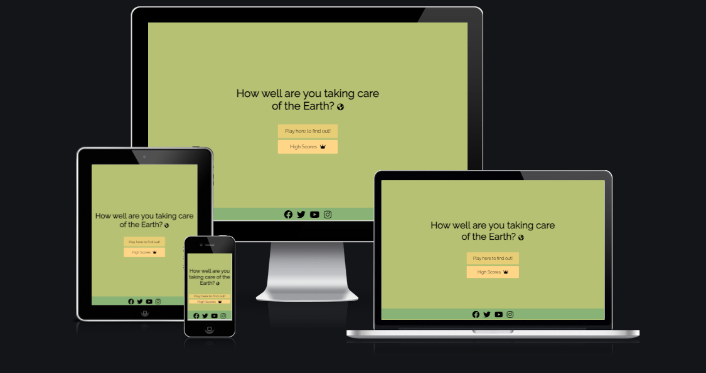

# Kids Earth quiz
Developed by Hira Zaidi

[Live webpage](https://hirazaidii.github.io/Earth-Quiz/)

## Table of Content

1. [Project Goals](#project-goals)
    1. [User Goals](#user-goals)
    2. [Site Owner Goals](#site-owner-goals)
2. [User Experience](#user-experience)
    1. [Target Audience](#target-audience)
    2. [User Requrements and Expectations](#user-requrements-and-expectations)
    3. [User Stories](#user-stories)
3. [Design](#design)
    1. [Design Choices](#design-choices)
    2. [Colour](#colours)
    3. [Fonts](#fonts)
    4. [Structure](#structure)
    5. [Wireframes](#wireframes)
4. [Technologies Used](#technologies-used)
    1. [Languages](#languages)
    2. [Frameworks & Tools](#frameworks-&-tools)
5. [Features](#features)
6. [Testing](#validation)
    1. [HTML Validation](#HTML-validation)
    2. [CSS Validation](#CSS-validation)
    3. [Accessibility](#accessibility)
    4. [Performance](#performance)
    5. [Device testing](#performing-tests-on-various-devices)
    6. [Browser compatibility](#browser-compatability)
    7. [Testing user stories](#testing-user-stories)
8. [Bugs](#Bugs)
9. [Deployment](#deployment)
10. [Credits](#credits)
11. [Acknowledgements](#acknowledgements)

## Project Goals 
I have made this quiz as a fun way for kids to test their knowledge of the best practices we can have to keep the Earth a bit cleaner. 
These are simple yet powerfull ways to create a sustainable environment.

### User Goals
•	Test (your kids) knowledge of how to keep the Earth at it's best
•	Be able to see your score during quiz
•	Be able to see highscores/leaderboard
•	Be able to insert a username
•	Be able to play again at the end

### Site Owner Goals
•	Provide a fun quiz to educate kids
•	Provide leaderbord of highscores for user
•	Provide option to play again at the end
•	Provide links to social media pages

## User Experience
I have designed this quiz for parents that want to educate their children with basic good habits in a fun way.
•	People who are looking to do a fun quiz
•	People who want to educate their kids about best practices for the earth

### Target Audience
•	Parents that are looking for a fun quiz
•	Kids who want to learn about best practices
•	Kids that want to test their knowledge

### User Requirements and Expectations

- A simple and intuitive navigation system
- Links and functions that work as expected
- Good presentation and a visually appealing design regardless of screen size
- Accessibility

### User Stories
I have divided my user stories into two categories: new players and returning players

New players (first-time user)
Returning players (returning-user)

#### First-time User 
1. As a first time user, I want to play the game
2. As a first time user, I want to see the highscores
3. As a first time user, I want to be able to access social media links
4. As a first time user, I want to see what question I am on during play
5. As a first time user, I want to know my score during the game

#### Returning User
6. As a returning user, I want to see the highscores
7. As a returning user, I want to be able to play again
8. As a first time user, I want to see what question I am on during play
9. As a first time user, I want to know my score during the game
10. As a returning user, I want to find the social media pages

#### Site Owner 
11. As the site owner, I want users to be see the leaderbord
12. As the site owner, I want users to be able to save their score/name
13. As the site owner, I want the users to be able to play the quiz
14. As the site owner, I want the users to be able to play again at the end
14. As the site owner, I want the users to see the social media pages

## Design

### Design Choices
The webpage was designed to look calm and clear in shades of green. 

### Colour
For the colour scheme green tones were selected by coolers.co.

Afterwards I used ColorSpace to select a matching pallete. To see what contrast matches best I used Eightshapes to see what text color will match.

### Fonts
Raleway was imported from google fonts.

### Structure
The page is structured in a well know, recognizable, user friendly, and easy to learn way. Upon arriving to the website, the user has 2 options to play again or look at the scoreboard.
The website consists of 4 separate pages: 
- A homepage with the option to look at the scores or play the game
- A quiz page where you can play the game
- An end page where you can play again or save you score/name 
- A page with the highscores and names 

### Wireframes

Home

Quiz

End

Highscores

## Technologies Used

### Languages
- HTML
- CSS
- Javascript

### Frameworks & Tools

- Git
- GitHub
- Gitpod
- Tinypng
- EighShapes
- Balsamiq
- Google Fonts
- Adobe Color
- Font Awsome
- Favicon

## Features
The quiz consists of 4 pages and 12 features

### Homepage
- A button to play the game that leads to the game.html page
- A button to view the highscores that leads to highscores.html
- User stories 1, 2, 6, 7, 

Screenshots

### Quiz page
- Question counter
- Score counter
- Question area
- Multiple choice answer
- User stories 4, 5, 8, 9

Screenshots

### End page
- Total score
- Insert name and save score option
- Play again button
- Button to return home
- User stories 6, 7

Screenshots

### Highscores page
- Leaderboard
- Return to home button

Screenshots

###  Footer
- Visible on each page with clickable links to social media channels that open in separate window
- User stories 3, 10

Screenshots

## Validation

### HTML Validation
The W3C Markup Validation Service was used to validate the HTML of the website. All pages pass with no errors no warnings to show.

Home

Quiz

End

Highscores

### CSS Validation
The W3C Jigsaw CSS Validation Service was used to validate the CSS of the website.

style.css

### Accessibility
The WAVE WebAIM web accessibility evaluation tool was used to ensure the website met high accessibility standards. All pages pass with 0 errors.

Home

Quiz

End

Highscores

### Performance 
Google Lighthouse in Google Chrome Developer Tools was used to test the performance of the website. 

Home

Game

End

Highscores

### Performing tests on various devices 
The website was tested on the following devices:
- Iphone 12 pro max
- Iphone 13 pro max

In addition, the website was tested using Google Chrome Developer Tools Device Toggeling option for all available device options.

### Browser compatability
The website was tested on the following browsers:
- Google Chrome
- Mozilla Firefox
- Microsoft Edge

## Deployment
The website was deployed using GitHub Pages by following these steps:
1. In the GitHub repository navigate to the Settings tab
2. On the left hand menu select Pages
3. For the source select Branch: main
4. After the webpage refreshes automaticaly you will se a ribbon on the top saying:  Your site is published at https://hirazaidii.github.io/Earth-Quiz/

You can for fork the repository by following these steps:
1. Go to the GitHub repository
2. Click on Fork button in upper right hand corner

You can clone the repository by following these steps:
1. Go to the GitHub repository 
2. Locate the Code button above the list of files and click it 
3. Select if you prefere to clone using HTTPS, SSH, or Github CLI and click the copy button to copy the URL to your clipboard
4. Open Git Bash
5. Change the current working directory to the one where you want the cloned directory
6. Type git clone and paste the URL from the clipboard ($ git clone https://github.com/YOUR-USERNAME/YOUR-REPOSITORY)
7.Press Enter to create your local clone.

## Credits

### Code
- Code Institute Slack Community
- LMS Love Running project
- LMS Coders Coffeehouse project
- My own Stress Escape project
- Brian Design youtube tutorials
- Dani Krossing youtube tutorials

### Media
- Font Awesome

## Acknowledgements
I would like to take the opportunity to thank:
- My husband Shahbaz for his support through out my stress moments.
- My mentor Mo Shami for his feedback, advice, guidance and support.
- The Code Institute slack community of students and alumni for their helpful advice, resources, guidance and support.